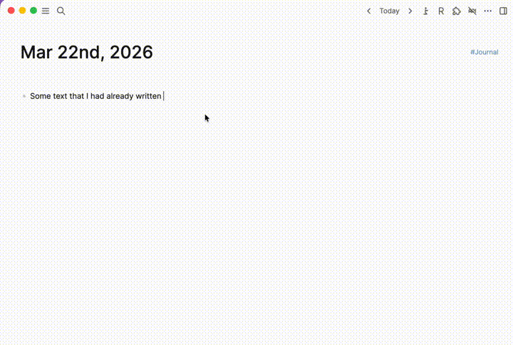

# Logseq Vim Editor Plugin

A Vim-powered editor panel for Logseq, using CodeMirror with Vim keybindings and markdown table editing support.

## Overview

Opens a resizable side panel with a full Vim-mode editor (powered by CodeMirror and `@replit/codemirror-vim`) for editing block content. Changes are autosaved back to the block. Includes built-in markdown table editing via `@susisu/mte-kernel`.

## Features

- Vim keybindings via CodeMirror
- Markdown syntax highlighting
- Resizable side panel (drag the left edge or configure width in settings)
- Autosave to the source block
- Markdown table editing:
  - `Tab` / `Shift-Tab` to navigate between cells
  - `Enter` to move to the next row
  - `Cmd/Ctrl+Shift+F` to format the table
- Line numbers and line wrapping
- Click the block UUID link in the header to scroll to the block in Logseq

## Installation

Install from the marketplace or load the plugin locally.

## Usage

1. Edit a block and use the slash command `/Edit in VIM mode`.
2. The Vim editor opens in a side panel with the block's content.
3. Edit using Vim keybindings. Changes are autosaved to the block.
4. Click the `✕` button to close the editor panel.

## Configuration

| Setting | Default | Description |
|---------|---------|-------------|
| Vim Editor Width | `600` | Width of the editor panel in pixels. Can also be adjusted by dragging the left edge of the panel. |

## License

This project is licensed under the MIT License. See the [LICENSE](./LICENSE) file for details.
